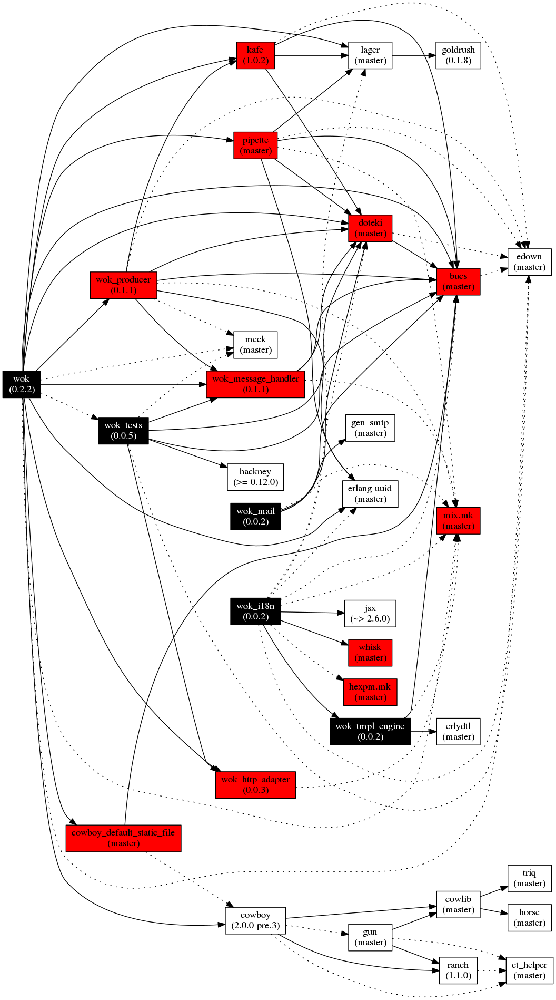
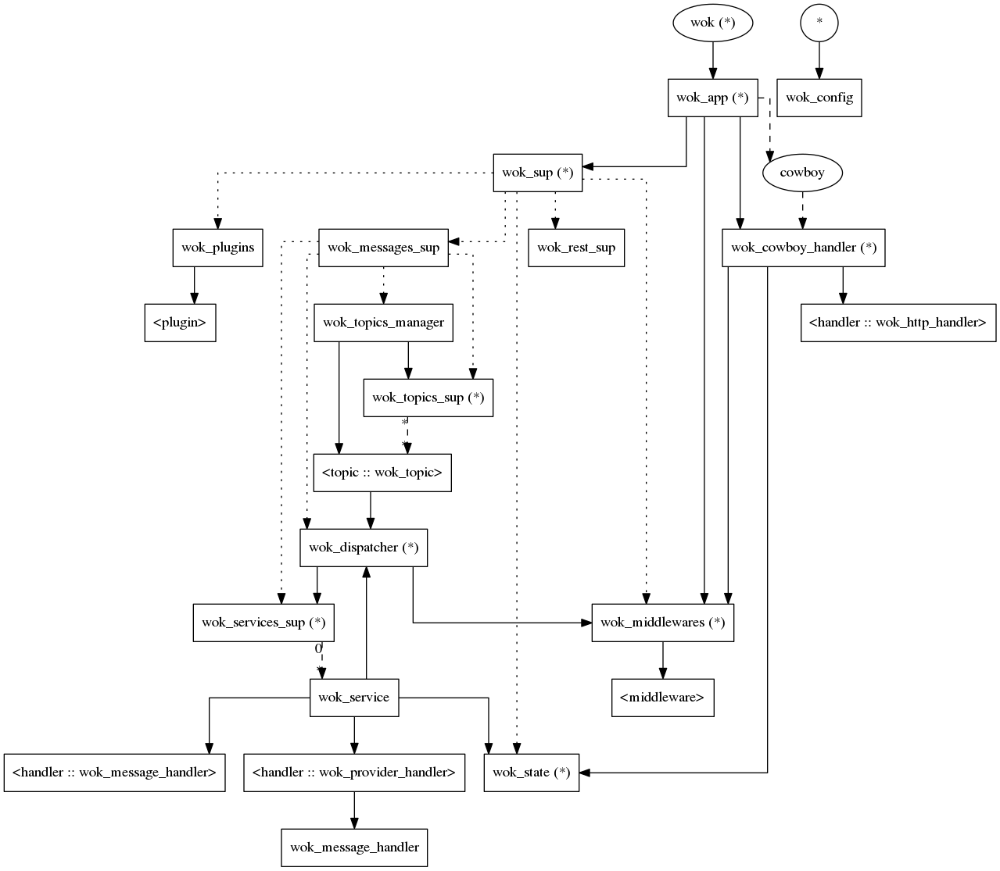

# Microservice framework for Erlang #

Copyright (c) 2015 Grégoire Lejeune, 2015 G-Corp

__Version:__ 0.0.1

__Authors:__ Gregoire Lejeune ([`gregoire.lejeune@gmail.com`](mailto:gregoire.lejeune@gmail.com)), Gregoire Lejeune ([`greg@g-corp.io`](mailto:greg@g-corp.io)).


### Create a microservice with wok ###


#### Erlang ####

1. Add wok in your dependencies :

```

{wok, ".*", {git, "git@gitlab.botsunit.com:msaas/wok.git", {branch, "master"}}}

```

2. Create your services and routes.

3. Reference your services and routes in the `config` file (see [Configuration](https://gitlab.botsunit.com/msaas/wok/tree/kafe-2.0.0/doc/README.md#conf))

3. Start your service :

```

application:ensure_all_started(wok).

```


#### Elixir ####


#### Ruby ####


#### Python ####


#### Javascript ####
<a name="conf"></a>

### Configuration ###

* `messages :: list()` : [Messages configuration](https://gitlab.botsunit.com/msaas/wok/tree/kafe-2.0.0/doc/README.md#messages_conf)

* `rest :: list()` : [REST configuration](https://gitlab.botsunit.com/msaas/wok/tree/kafe-2.0.0/doc/README.md#rest_conf)

<a name="messages_conf"></a>

#### Messages configuration ####

* `handler :: atom()` : handler used to create and parse messages. See [wok_message_handler](https://gitlab.botsunit.com/msaas/wok_message_handler) for more informations.

* `services :: list()` : [Services configuration](https://gitlab.botsunit.com/msaas/wok/tree/kafe-2.0.0/doc/README.md#services_conf)

* `consumer_group :: binary() | random | {random, [{prefix, term()}]}` : Name of the Kafka' consumer group

* `local_queue_name :: binary()` : Name of the pipette' queue

* `local_consumer_group :: binary() | random | {random, [{prefix, term()}]}` : Name of the pipette' consumer group

* `max_services_fork :: integer()` : Maximum number of messages in parallel

* `topics :: list()` : [Topics configuration](https://gitlab.botsunit.com/msaas/wok/tree/kafe-2.0.0/doc/README.md#topic_conf)

* `from_beginning :: true | false` : Start consuming from beginning (default true)

<a name="rest_conf"></a>

#### REST configuration ####

* `port :: integer()` : Port to use for the REST API (default: `8080`)

* `ip :: list()` : IP to use for the REST API (default: `0.0.0.0`)

* `max_conn :: integer()` : Max number of  connexions (default: `100`)

* `routes :: list()` : [Routes configuration](https://gitlab.botsunit.com/msaas/wok/tree/kafe-2.0.0/doc/README.md#routes_conf)

<a name="services_conf"></a>

#### Services configuration ####

```

{<<"my_service">>, {my_service_module, my_service_function}}

```
<a name="topics_conf"></a>

#### Services configuration ####

```

{<<"topic">>, [{fetch_frequency, 5000}, {max_bytes, 10485760}]}

```
<a name="routes_conf"></a>

#### Routes configuration ####

```

{'GET', "/path", {route_module, route_function}}

```


### Dependencies ###




### Call tree ###




## Start Kafka ##

Update `docker-compose.yml` and change `KAFKA_ADVERTISED_HOST_NAME` to the IP of your `docker0` interface.

```

docker-compose up -d
kafka-topics.sh --create --zookeeper localhost:2181 --replication-factor 3 --partitions 3 --topic test
kafka-topics.sh --create --zookeeper localhost:2181 --replication-factor 3 --partitions 3 --topic repl
kafka-topics.sh --create --zookeeper localhost:2181 --replication-factor 3 --partitions 3 --topic service
kafka-topics.sh --create --zookeeper localhost:2181 --replication-factor 3 --partitions 3 --topic public
...
docker-compose stop

```


### Licence ###

Copyright (c) 2015 Grégoire Lejeune

Copyright (c) 2015 G-Corp

Unauthorized copying of this software, via any medium is strictly prohibited

Proprietary and confidential


## Modules ##


<table width="100%" border="0" summary="list of modules">
<tr><td><a href="https://gitlab.botsunit.com/msaas/wok/tree/kafe-2.0.0/doc/wok_message.md" class="module">wok_message</a></td></tr>
<tr><td><a href="https://gitlab.botsunit.com/msaas/wok/tree/kafe-2.0.0/doc/wok_producer.md" class="module">wok_producer</a></td></tr>
<tr><td><a href="https://gitlab.botsunit.com/msaas/wok/tree/kafe-2.0.0/doc/wok_request.md" class="module">wok_request</a></td></tr>
<tr><td><a href="https://gitlab.botsunit.com/msaas/wok/tree/kafe-2.0.0/doc/wok_response.md" class="module">wok_response</a></td></tr>
<tr><td><a href="https://gitlab.botsunit.com/msaas/wok/tree/kafe-2.0.0/doc/wok_routes.md" class="module">wok_routes</a></td></tr></table>

