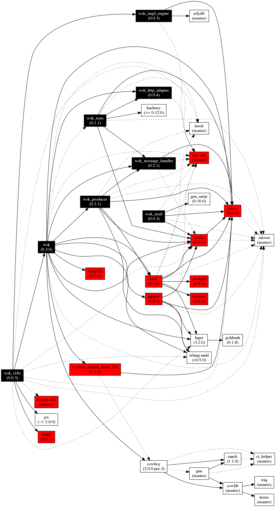

# Microservice framework for Erlang #

Copyright (c) 2015 Grégoire Lejeune, 2015 G-Corp

__Version:__ 0.0.1

__Authors:__ Gregoire Lejeune ([`gregoire.lejeune@gmail.com`](mailto:gregoire.lejeune@gmail.com)), Gregoire Lejeune ([`greg@g-corp.io`](mailto:greg@g-corp.io)).


### Create a microservice with wok ###


#### Erlang ####

1. Add wok in your dependencies :

```

{wok, ".*", {git, "git@gitlab.botsunit.com:msaas/wok.git", {branch, "master"}}}

```

2. Create your services and routes.

3. Reference your services and routes in the `config` file (see [Configuration](#conf))

3. Start your service :

```

application:ensure_all_started(wok).

```


#### Elixir ####


#### Ruby ####


#### Python ####


#### Javascript ####
<a name="conf"></a>

### Configuration ###

* `messages :: list()` : [Messages configuration](#messages_conf)

* `rest :: list()` : [REST configuration](#rest_conf)

<a name="messages_conf"></a>

#### Messages configuration ####

* `handler :: atom()` : handler used to create and parse messages. See [wok_message_handler](https://gitlab.botsunit.com/msaas/wok_message_handler) for more informations.

* `services :: list()` : [Services configuration](#services_conf)

* `consumer_group :: binary() | random | {random, [{prefix, term()}]}` : Name of the Kafka' consumer group

* `local_queue_name :: binary()` : Name of the pipette' queue

* `local_consumer_group :: binary() | random | {random, [{prefix, term()}]}` : Name of the pipette' consumer group

* `max_services_fork :: integer()` : Maximum number of messages in parallel

* `topics :: list()` : [Topics configuration](#topic_conf)

* `from_beginning :: true | false` : Start consuming from beginning (default true)

<a name="rest_conf"></a>

#### REST configuration ####

* `port :: integer()` : Port to use for the REST API (default: `8080`)

* `ip :: list()` : IP to use for the REST API (default: `0.0.0.0`)

* `max_conn :: integer()` : Max number of  connexions (default: `100`)

* `routes :: list()` : [Routes configuration](#routes_conf)

<a name="services_conf"></a>

#### Services configuration ####

```

{<<"my_service">>, {my_service_module, my_service_function}}

```
<a name="topics_conf"></a>

#### Services configuration ####

```

{<<"topic">>, [{fetch_frequency, 5000}, {max_bytes, 10485760}]}

```
<a name="routes_conf"></a>

#### Routes configuration ####

```

{'GET', "/path", {route_module, route_function}}

```


### Dependencies ###




### Call tree ###


## Start Kafka ##

Update `docker-compose.yml` and change `KAFKA_ADVERTISED_HOST_NAME` to the IP of your `docker0` interface.

```

docker-compose up -d
kafka-topics.sh --create --zookeeper localhost:2181 --replication-factor 3 --partitions 3 --topic test
kafka-topics.sh --create --zookeeper localhost:2181 --replication-factor 3 --partitions 3 --topic repl
kafka-topics.sh --create --zookeeper localhost:2181 --replication-factor 3 --partitions 3 --topic service
kafka-topics.sh --create --zookeeper localhost:2181 --replication-factor 3 --partitions 3 --topic public
...
docker-compose stop

```


### Licence ###

Wok is available for use under the following license, commonly known as the 3-clause (or "modified") BSD license:

Copyright (c) 2015, G-Corp<br />
Copyright (c) 2015, 2016, 2017 BotsUnit<br />

Redistribution and use in source and binary forms, with or without modification, are permitted provided that the following conditions are met:

* Redistributions of source code must retain the above copyright notice, this list of conditions and the following disclaimer.
* Redistributions in binary form must reproduce the above copyright notice, this list of conditions and the following disclaimer in the documentation and/or other materials provided with the distribution.
* The name of the author may not be used to endorse or promote products derived from this software without specific prior written permission.


THIS SOFTWARE IS PROVIDED BY THE AUTHOR `AS IS` AND ANY EXPRESS OR IMPLIED WARRANTIES, INCLUDING, BUT NOT LIMITED TO, THE IMPLIED WARRANTIES OF MERCHANTABILITY AND FITNESS FOR A PARTICULAR PURPOSE ARE DISCLAIMED. IN NO EVENT SHALL THE AUTHOR BE LIABLE FOR ANY DIRECT, INDIRECT, INCIDENTAL, SPECIAL, EXEMPLARY, OR CONSEQUENTIAL DAMAGES (INCLUDING, BUT NOT LIMITED TO, PROCUREMENT OF SUBSTITUTE GOODS OR SERVICES; LOSS OF USE, DATA, OR PROFITS; OR BUSINESS INTERRUPTION) HOWEVER CAUSED AND ON ANY THEORY OF LIABILITY, WHETHER IN CONTRACT, STRICT LIABILITY, OR TORT (INCLUDING NEGLIGENCE OR OTHERWISE) ARISING IN ANY WAY OUT OF THE USE OF THIS SOFTWARE, EVEN IF ADVISED OF THE POSSIBILITY OF SUCH DAMAGE.


## Modules ##


<table width="100%" border="0" summary="list of modules">
<tr><td><a href="wok.md" class="module">wok</a></td></tr>
<tr><td><a href="wok_message.md" class="module">wok_message</a></td></tr>
<tr><td><a href="wok_message_handler.md" class="module">wok_message_handler</a></td></tr>
<tr><td><a href="wok_producer.md" class="module">wok_producer</a></td></tr></table>

